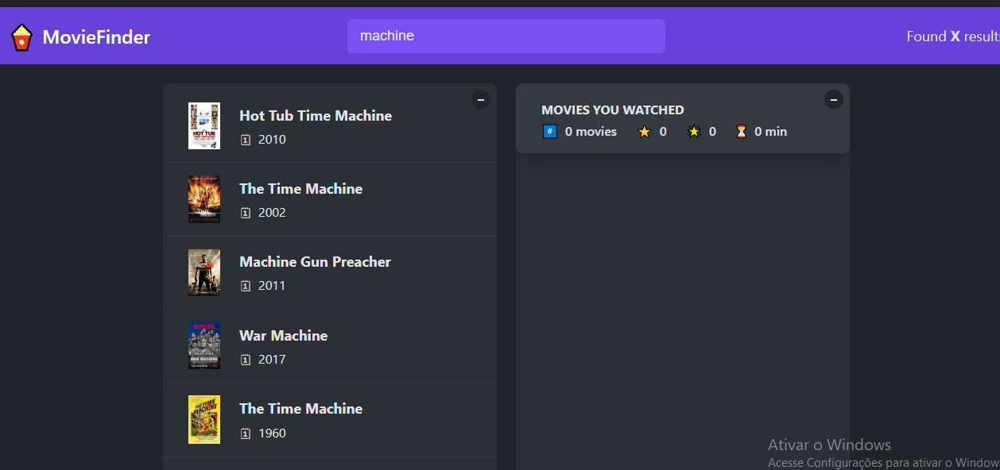

# MovieFinder React App

Um aplicativo React.js para buscar e explorar filmes usando uma API pública. Ele permite pesquisar filmes em tempo real e exibir informações relevantes como título, poster e descrição.


 

---

## Funcionalidades

- Pesquisa de filmes com query dinâmica
- Integração com API externa
- Exibição de resultados em cards responsivos
- Interface simples e intuitiva

---

## Tecnologias

- **React.js**  
- **JavaScript (ES6+)**  
- **Fetch API / Axios** (para requisições)  
- **CSS / Styled Components / Tailwind CSS** (conforme o projeto)  

---

## Como usar

1. Clone o repositório:
   ```bash
   git clone https://github.com/seu-usuario/moviefinder-reactjs-api.git
